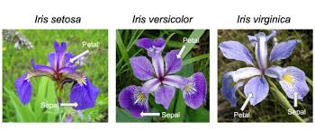
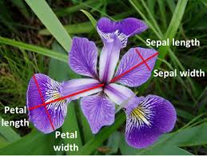

# Iris Dataset Analysis
### by Aoife Flavin 
---
This repository contains my analysis of the Iris dataset. The purpose of this repoitory is for my final project in the module Programming and Scripting, in Semester 1 of the Higher Diploma in Data Analytics at ATU.
---
## About the Iris dataset
The Iris dataset is a very commonly used dataset in the world of data science. It has been called the "Hello World of data science". The data is also sometimes known as  Fisher's Iris data set, after the biologist and statistician Ronald Fisher used it in his who used it in his 1936 paper 'The use of multiple measurements in taxonomic problems'.

The data set has 50 samples of three different species of Iris; Iris Setosa, Iris Virginica and Iris Versicolor.

Source: Kaggle

The dataset contains five columns:
* Sepal Length 
* Sepal Width
* Petal Length
* Petal Width
* Species

The following image displays the difference between the petal and the sepal in an Iris flower.

Source: Kaggle

### MVP Project plan
Get these tasks done by 12/05 and from there add extras
* ~~create repository~~
* Write a summary of the dataset in the readme
* ~~Download dataset & add to repository (done in Ian's lectures)~~
* ~~have analysis.py output a summary of each variable to a single text file (extracting the result of pandas . describe() of each variable to a txt file.)~~ (Need to test)
* ~~Create a histrgram of sepal length~~
* ~~Create a histrgram of sepal width~~
* ~~Create a histrgram of petal length~~
* ~~Create a histrgram of petal width~~
* ~~Create a bar chart of flower type~~
* ~~Create a scatter plot of sepal length x width~~
* ~~Create a scater plot of petal length x width~~
* ~~Create a scater plot of petal length x sepal width~~
* ~~Create a scater plot of petal length x sepal length~~
* ~~Create a scatter plot of petal width x sepal width~~
* ~~Create a scatter plot of petal width x sepal length~~
### Improved Project plan
Aim to complete by 19/20 so there is time for final touches
* ~~Convert these plots to seaborn, so they can be viewed together with the different species seperated by~~ colour
* ~~Add a boxplot chage colours to purple and explain it's significance#~~
* Do some distplots (check the geek4geek source for how to do)
* Add in some mathematical bits about correlation
* Use heatmaps to explai correlation (use geeks4geeks source)
* Insert all of the images of the plots created into the readme with a clear narrative

## Sources
https://en.wikipedia.org/wiki/Iris_flower_data_set#:~:text=The%20Iris%20flower%20data%20set,example%20of%20linear%20discriminant%20analysis.

https://github.com/mwaskom/seaborn-data/blob/master/iris.csv

Ian's lecture notes as a source

https://www.projectpro.io/recipes/write-text-file-output-of-for-loop

https://www.geeksforgeeks.org/exploratory-data-analysis-on-iris-dataset/ --> V good source

https://github.com/abhikumar22/Exploratory-Data-Analysis-on-IRIS-Dataset/blob/master/EDA_Flower.ipynb

https://www.youtube.com/watch?v=02BFXhPQWHQ --> Vid of anaylsis that doesn't use seaborn

https://www.kaggle.com/datasets/uciml/iris

https://towardsdatascience.com/create-and-customize-boxplots-with-pythons-matplotlib-to-get-lots-of-insights-from-your-data-d561c9883643 --> Boxplots

https://www.simplypsychology.org/boxplots.html

