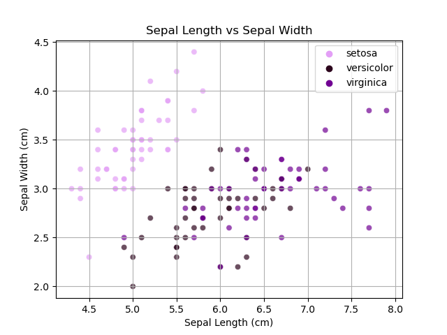
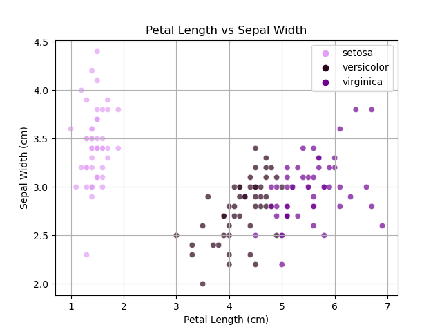
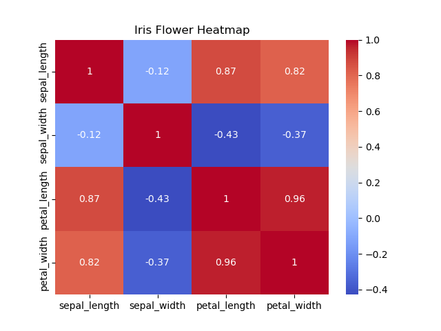

# Iris Dataset Analysis
### by Aoife Flavin 
---
This repository contains my analysis of the Iris dataset. The purpose of this repoitory is for my final project in the module Programming and Scripting, in Semester 1 of the Higher Diploma in Data Analytics at ATU.
---
## About the Iris dataset
The Iris dataset is a very commonly used dataset in the world of data science. It has been called the "Hello World of data science". The data is also sometimes known as  Fisher's Iris data set, after the biologist and statistician Ronald Fisher used it in his 1936 paper 'The use of multiple measurements in taxonomic problems'.

The data set has 50 samples each of three different species of Iris; Iris Setosa, Iris Virginica and Iris Versicolor.

Source: Kaggle

The dataset contains five columns:
* Sepal Length 
* Sepal Width
* Petal Length
* Petal Width
* Species

The following image displays the difference between the petal and the sepal in an Iris flower.

Source: Kaggle

## Exploratory Analysis
To begin my analysis I began by performing a count of each of the datatpoints in the variable 'species'. I then represented this data in a bar chart. As can be seen from the figure below, there is an even amount of data points for each species.

---
Following on from this I took a look at the statistical summary data of each of the variables, finding the mean, standard deviation, interquartile range and other data points to begin to understand the data. This summary data can be found [here.](variable_summary.txt)

In order to visualise the distribution of the individual variables I created four histograms.

### Sepal Length

This variable appears to be normally distributed, which is backed up by the statistical data, which puts the standard deviation at approxiately 14% of the mean. The standard deviation of this data is 0.828066, suggesting that throughout the sample data the length of sepals are close to the average length.

### Sepal Width

Similarly to Sepal Length, Sepal width also appears to be normally distributed, which is backed up by the statistical data, putting the standard deviation at approxiately 14% of the mean. The standard deviation of 0.435866 suggests that across the samples the length of sepals are not far off the average width.

### Petal Length

Petal Length, on the other hand, appears to be bimodally distributed. The standard deviation of approximately 1.765298 (around 47% of the mean) suggests a higher level of variability amongst the data. There appears to be a smaller cluster of data skewed to the right, which could be explained by one of the species of Iris having significantly smaller petals than the others.

### Petal Width

Similarly to Petal Length, Petal width is also bimodally distributed. It again has a relatively high standard deviation of 0.762238 (about 63% of the mean) suggesting a higher variability amongst the data.

---

In the next part of my analysis I created plots comparing each of the numerical variables to understand the realtionship between these variables. Each point on the plots represents an Iris flower, the different shades of purple of the dots represent the three different species of Iris.

### Sepal Length vs. Sepal Width

This figure shows the relationship between Sepal Length and Sepal Width. The data points on this plot are quite spread out, suggesting a higher level of variation within the data. There appears to be a weak positive correlation between sepal length and sepal width. This means that there is a *slight* tendancy for flowers that have longer sepals to also have wider sepals.

### Petal Length vs. Petal Width

This figure shows the relationship between Petal Length and Petal Width. In this plot the data points are much less spread out and are clustered mainly by species. There is a strong positive correlation between these variables, indicating that as petal length increases, petal width increases proportionately with it. It is also clear that the Setosa species tend to have much smaller petals than the other two species.

### Petal Length vs. Sepal Length

This figure shows the relationship between Petal Length and Sepal Length. Again in this plot the data is clustered by species. There is a strong positive correlation between these vaiables for the species Versicolor and Virginica. However, there does does not appear to be much correlation at all in the Setosa's. This implies that an increase in petal length does not effect the length of the sepal in the species Setosa. 

### Petal Length vs. Sepal Width

This figure shows the relationship between Petal Length and Sepal Width. The data in this plot is more spread out than the previous, but is still separated into clustered. Similarly to the last, there does not appear to be any correlation between petal length and sepal width in the species Setosa, but there is decent positive correlation between the other two species. Interesingly, it can be observed that the sepal of the Setosa seems to be wider in general than it's counterparts, where in every other aspect it tends to be smaller.

### Petal Width vs. Sepal Length

This figure shows the relationship between Petal Width and Sepal Length. The data in this plot is also spread out more than previous plots, but is similar in that there appears to be some positive correlation between the variables for the species Versicolor and Virginica, whereas there is little to no correlation between petal width and sepal length for the species Setosa.

### Petal Width vs. Sepal Width

This figure shows the relationship between Petal Width and Sepal Width. This plot has very similar characteristics to the previous one, oneof the main differences being that this plot demonstrates,once again, that Setosa's have much wider Sepals than the other species

### Comparison

This plot simply displays each of the individual scatter plots in one figure to highlight the similarities and differences in correlation between each plot.
---

Next I created some Box Plots to get a deeper understanding of the distribution of the data.

### Boxplot by Species

This plot visually demonstrates that for both the Virginica and Versicolor species, there's a tendency towards longer lengths and narrower widths for both the petal and sepal. However, in the case of the Setosa species, we observe a distinct pattern: its petals the shortest and narrowest of the bunch, while the sepals are notably much wider compared to the other species. Furthermore, it can be observed that there is less variation in the sepal size of the setosa, than of the other species. The setosa also has the highest number of outliers of any of the species, demonstrated by the Os located outside the whiskers of the box plot.

### Boxplot by Variable

This plot demonstrates clearly that the species Setosa has the smallest features and is less distributed with the most outliers. The species Virginica tends to have the largest features, while the species Versicolour falls in between them, closer to Virginica than Setosa.

---

The final plot I created in this analysis is a heatmap of all of the variables, which allows me to determine patterns in the correlation of this data.

### Heatmap

This heatmap shows the pairwise correlation coefficients between the numeric variables giving a clearer picure of how features are related to eachother.
This is what the heatmap tells us about the correlation of variables:
* Petal length and width are very highly correlated
* Petal length and sepal length are also strongly correlation
* Similarly, Petal width and Sepal Length are highly correlated.
* The variables with the lowest correlation are Sepal width and Sepal length.

## Summary & Conclusion

For this analysis I mainly used the Pandas, Matpllotlib and Seaborn modules to investigate, analyse and visualise the Iris dataset.

The Iris dataset is quite small, with only 150 observations so I am limited in the conclusions that I can draw from this dataset. But from my analysis I have learned:

The Setosa is clearly different from the other species, notably with much wider Sepals that have little correlation with its other features. However, in all other asects the Setosa tends to be the smalest of the flowers. 

It is not as simple to separate the species Versicolor and Virginica from eachother, as there is quite a bit of overlap between these species. But in general I can conclude that the species Virginica is the largest flower in all aspects except sepal width, with Versicolor following closely behind. These variables also share a similar corelation between each of the variables.

Some other analyses use histplots from the seaborn library to compare the distribution of data in each variable. For further analysis it would also be possible to create separate heatmaps per species to examine in more detail how the correlation varies by species. 

## Sources
https://en.wikipedia.org/wiki/Iris_flower_data_set#:~:text=The%20Iris%20flower%20data%20set,example%20of%20linear%20discriminant%20analysis.

https://github.com/mwaskom/seaborn-data/blob/master/iris.csv

https://www.projectpro.io/recipes/write-text-file-output-of-for-loop

https://www.geeksforgeeks.org/exploratory-data-analysis-on-iris-dataset/ 

https://github.com/abhikumar22/Exploratory-Data-Analysis-on-IRIS-Dataset/blob/master/EDA_Flower.ipynb

https://www.youtube.com/watch?v=02BFXhPQWHQ 

https://www.kaggle.com/datasets/uciml/iris

https://towardsdatascience.com/create-and-customize-boxplots-with-pythons-matplotlib-to-get-lots-of-insights-from-your-data-d561c9883643

https://www.simplypsychology.org/boxplots.html

https://medium.com/@hfahmida/eda-for-iris-dataset-with-boxplots-violin-plots-heatmap-pairwise-plots-535275b4c2a0#:~:text=The%20correlation%20heatmap%20shows%20the,sepal%20length%20and%20petal%20length.

https://zion-oladiran.medium.com/exploratory-data-analysis-iris-dataset-68897497b120 

---
## End